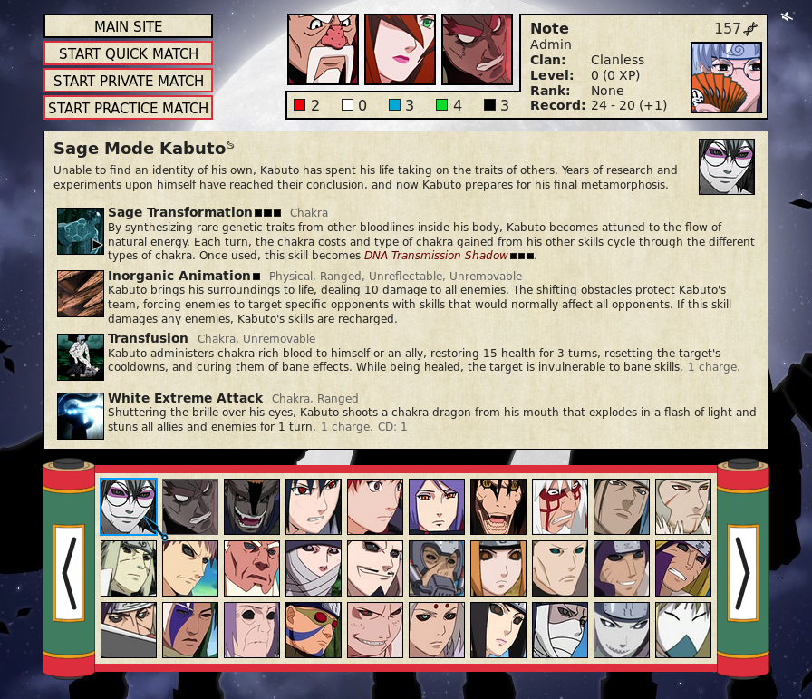
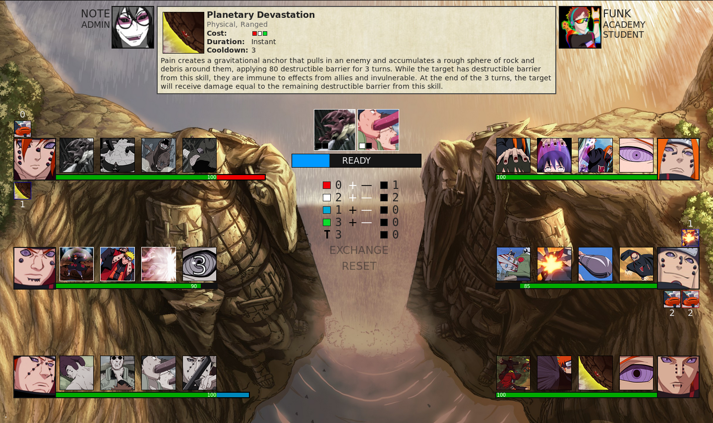

# Naruto Unison

The next generation of [Naruto Arena](naruto-arena.com), built from the ground up in Haskell and Elm.

*Naruto* was created by Masashi Kishimoto, published by Pierrot Co., and licensed by Viz Media.

## Installing

1. Install [Stack](https://docs.haskellstack.org/en/stable/install_and_upgrade/), [PostgreSQL](https://www.postgresql.org/download/), and [NPM](https://www.npmjs.com/get-npm). Make sure all executables are added to your path.

2. Run `stack install yesod-bin`.

2. In the [elm](elm/) folder of the project, run `npm install`.

3. In the root directory of the project, run `stack build`.

4. Start up the PostgreSQL server,.

5. Create a new database and add it to the PostgreSQL [pg_hba.conf](https://www.postgresql.org/docs/9.1/auth-pg-hba-conf.html) file.

6. Configure environment variables in [config/settings.yml](config/settings.yml) to point to the database.

## Running

To use a development web server, run `stack exec -- yesod devel` in the root directory of the project.

In order to run the server in production mode, which has significantly better performance, deploy it with [Keter](https://www.yesodweb.com/blog/2012/05/keter-app-deployment). It is recommended to use a standalone server for hosting the Keter bundle and PostgreSQL database.
